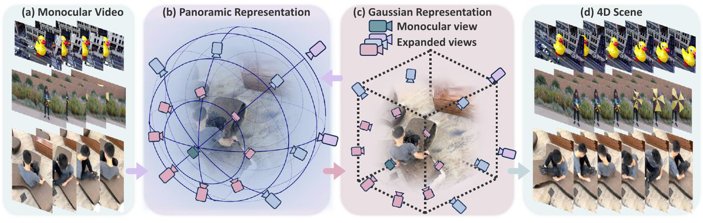
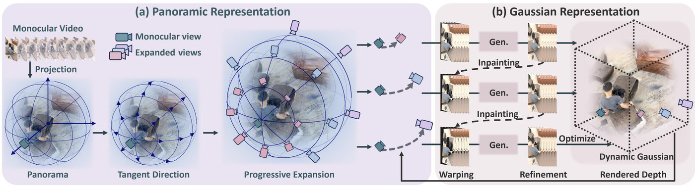

<h1 align="center">Unified Panoramic–Gaussian Representation for Monocular 4D Scene Synthesis</h1>

<p align="center">
  <a href="PanoGaussian_ECCV2026.pdf">Paper</a>
</p>

<p align="center">
  <a href="https://yangyuankun865.github.io/">Yuankun Yang</a><sup>1</sup>,
  Yi Wei<sup>2</sup>,
  Wenyang Zhou<sup>2</sup>,
  <a href="https://lzrobots.github.io/">Li Zhang</a><sup>1</sup> ✉
</p>

<p align="center">
  <sup>1</sup>School of Data Science, Fudan University &nbsp;&nbsp;
  <sup>2</sup>Central Media Technology Institute, Huawei
</p>

<p align="center"><strong>ECCV 2026</strong></p>

<p align="center">
  
</p>

**PanoGaussian** reformulates monocular 4D synthesis as scene completion with unseen regions. It unifies panoramic trajectory guidance with dynamic Gaussian splatting, distilling panoramic exploration into an explicit 4D representation that preserves both global consistency and physical motion priors.

## Method

**PanoGaussian** integrates panoramic exploration and Gaussian optimization in a unified framework:

- **Panoramic trajectory paradigm** aligns training and inference under the same panoramic warping protocol.
- **Progressive expansion strategy** expands views along evenly spaced tangent directions with fixed-geometry warping to avoid error accumulation.
- **Panoramic–Gaussian representation** distills refined generative outputs into dynamic Gaussians via masked refinement on newly hallucinated regions.

<p align="center">
  
</p>

Given a monocular video, PanoGaussian projects observations into panoramic space, progressively expands scene coverage, and unifies panoramic exploration with dynamic Gaussian optimization.

## BibTeX

If you find this project helpful, please consider citing our [paper](PanoGaussian_ECCV2026.pdf):

```bibtex
@inproceedings{yang2026panogaussian,
  title     = {Unified Panoramic--Gaussian Representation for Monocular 4D Scene Synthesis},
  author    = {Yang, Yuankun and Wei, Yi and Zhou, Wenyang and Zhang, Li},
  booktitle = {European Conference on Computer Vision (ECCV)},
  year      = {2026}
}
```
